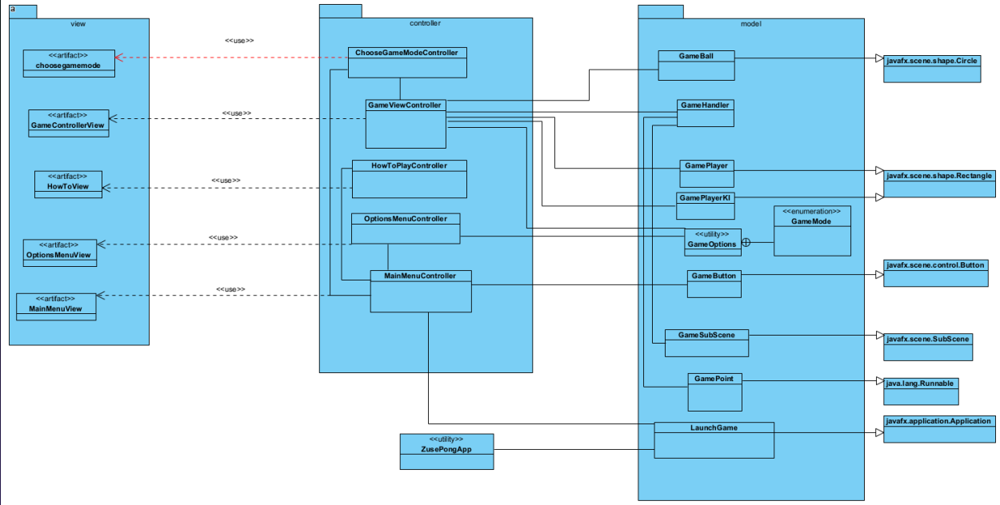

# Pong by Team Zuse
Dieses Repository gehört zu der Prüfungsvorleistung zum Modul Programmierung 3 (KIB-PRG3) der HTW saar.

## Ziel des Projekts
Es soll ein Spiel namens Pong implementiert werden. Das Spiel soll 2 Spieler und einen Punkt (Ball), den sich auf dem Bildschirm hin und her bewegt, haben. Jeder Spieler soll den Punkt durch einen Schläger (einen senkrechten Strich) steuern können (nach oben oder nach unten). Der Gegner erhält einen Punkt, wenn der Spieler den Ball verliert. Der parallele Ablauf der Komponenten des Spiels soll mithilfe von Multi-Threading implementiert werden.

## Architektur

#### Use Cases / User Stories

- Singleplayer Modus des Spiels Pong gegen eine KI
  - dynamische Anpassung der KI anhand des Spielverhaltens (guter Spieler == bessere KI, schlechter Spieler == ungenaue KI)
- lokaler Multiplayer Modus gegen weiteren Spieler am selben Endgerät mittels Threading
- Scoreboard Feature
- Variable Steuerung über ein Optionsmenü
- Hilfe-Menü mit kurzer Erklärung des Spiels
- Erweiterbarkeit durch dynamische Funktionalitäten für folgende künftige Features:
    - dynamische Anpassung der Fenstergröße
    - Schwierigkeitsmodi für den Singleplayer
    

#### Lösungsstrategie
Geben Sie eine kompakte Beschreibung der Kernidee Ihres Lösungsansatzes. Begründen Sie wichtige Designentscheidungen. Z.B. die Wahl der Middleware, der Programmiersprache, des Architekturansatzes etc.

#### Klassendiagramme



## Getting Started
Dokumentieren Sie, wie man ihr Projekt bauen, installieren und starten kann.

#### Voraussetzungen
Welche Voraussetzungen werden benötigt, um ihr Projekt zu starten: Frameworks, Software, Libraries, ggf. Hardware.

#### Installation und Deployment

Schritt-für-Schritt-Anleitung zum manuellen Compilieren:

Voraussetzung: Sie befinden sich im Ordner src\main\java

Hinweis: Path abhängig von betriebssystemunabhängigem Path-Separator! ggf. Anpassung nötig!

Compile:
```shell
javac de\htwsaar\pong\zuse\model\*.java de\htwsaar\pong\zuse\controller\*.java --module-path %PATH_TO_JFX_LIB% --add-modules javafx.controls,javafx.fxml de\htwsaar\pong\zuse\ZusePongApp.java
```
Run:
```shell
java --module-path %PATH_TO_JFX_LIB% --add-modules javafx.controls,javafx.fxml de.htwsaar.pong.zuse.ZusePongApp
```

## Built With
Geben Sie an, welche Frameworks und Tools Sie verwendet haben. Z.B.:

* [OpenJFX 16](https://openjfx.io/) - open source client application platform
* [SceneBuilder](https://gluonhq.com/products/scene-builder/) - visual layout tool for JavaFX Applications
* [Apache Maven](https://maven.apache.org/) - software project management tool used during development

## License

This project is licensed under the GNU General Public License v3.0

## Credits
* Dipl.-Ing. (FH) Michael Sauer DEA (UVigo) - Dozent des Moduls Programmierung 3 und Aufgabenersteller
* Anas Alajaji - Programmberatung
* Sayed Mustafa Sajadi - Programmberatung
* Maram Albaali - Entwicklerin
* Marcel Hesselbach - Teamkommunikator und Entwickler
* Isabelle Müller - Entwicklerin
* Jorin Moritz Spiller - Entwickler
* Amin Yousif - Entwicklerin
* every StackOverflow Member - technische und seelische Unterstützung
